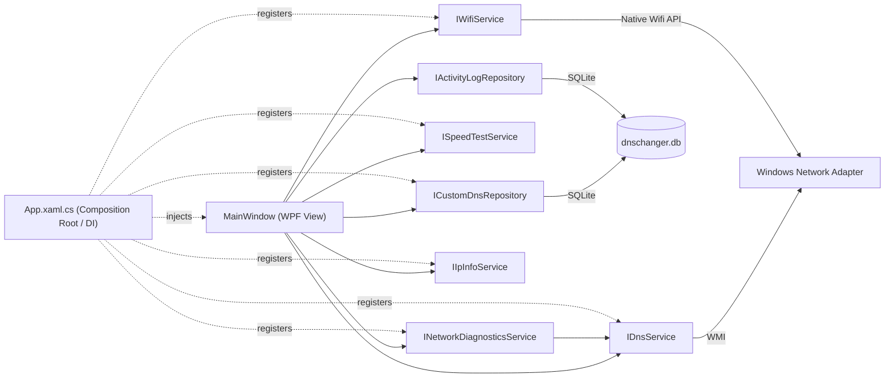

<div align="center">


# Network Toolkit

**A modern Windows network toolkit: one-click DNS switching, automatic connection diagnostics and repair, live speed testing, Wi-Fi management, and IP lookup — fully localized in Persian and English.**

Built with WPF, .NET 8, SQLite, and a clean layered architecture.


[Features](#-features) • [Architecture](#-architecture) • [Getting Started](#-getting-started) • [Roadmap](#-roadmap) • [Author](#-author)

</div>

---

## 📖 Overview

Network Toolkit started as a simple DNS changer and grew into a full desktop network utility: it diagnoses and automatically repairs common connectivity problems, tests real network speed, scans and connects to nearby Wi-Fi networks, looks up IP geolocation, and keeps a full activity log — all from a single themeable, bilingual, multi-page interface that runs quietly from the system tray when not in use.

Rather than being a quick single-file script, the project is deliberately structured the way a production application would be: UI and business logic are separated, dependencies are injected, data is persisted in SQLite, services are free of UI and language concerns, and the codebase is built to be testable and extendable.

## 📸 Screenshots

<table>
  <tr>
    <td></td>
    <td></td>
  </tr>
  <tr>
    <td align="center">DNS servers</td>
    <td align="center">Live speed test</td>
  </tr>
  <tr>
    <td></td>
    <td></td>
  </tr>
  <tr>
    <td align="center">Diagnose &amp; auto-fix</td>
    <td align="center">Wi-Fi networks</td>
  </tr>
  <tr>
    <td></td>
    <td></td>
  </tr>
  <tr>
    <td align="center">Light theme with custom accent</td>
    <td align="center">Persian (right-to-left)</td>
  </tr>
</table>

## ✨ Features

- ⚡ **One-click DNS switching**, with all providers (built-in and user-added) stored in SQLite and managed from a single list — add, apply, or delete any entry
- 🔍 **Automatic adapter detection** — finds the active Wi-Fi/Ethernet interface, no manual setup
- 🛠 **Custom automatic diagnostics engine** — checks the connection layer by layer (adapter → gateway → raw internet → DNS resolution), tests multiple domains to avoid false positives from a single filtered host, falls back through several known-good DNS providers automatically, and retries an adapter restart if the router is unreachable — built from scratch rather than shelling out to Windows' own troubleshooter
- 📶 **Live Wi-Fi scanning and connecting** — real nearby networks with per-bar signal strength and security type; reconnects silently using a saved profile when possible, and only prompts for a password when one is actually needed
- 🚀 **Real speed test** — download, upload, ping, and jitter, streamed live with an animated gauge and a rolling fluctuation chart; each result appears the moment it's ready rather than all at once at the end
- 🌍 **IP geolocation lookup** — your own IP's country, ISP, and time zone, plus a field to look up any address
- 📜 **Full activity log** — every DNS change, cache flush, adapter restart, Wi-Fi connection, speed test, and diagnostic run is recorded and viewable, with a one-click clear
- 🌐 **Full Persian/English localization** — switching the language also flips the entire interface between right-to-left and left-to-right, live, with no restart
- 🎨 **Dark/light theme with 7 selectable accent colors**, persisted across restarts, with custom-styled dialogs to match (including a password prompt) instead of default Windows message boxes
- 🖥 **Custom title bar and system tray integration** — a themed frameless window, and closing to the tray with quick actions (apply any saved DNS, reset, run diagnostics) from a fully custom-styled tray menu
- 🔐 **Administrator-privilege detection** before any network change is applied

## 🏗 Architecture



```
DnsChanger/
├── Models/            # Plain data models (DnsProvider, CustomDnsEntry, DiagnosticStepResult,
│                       #   SpeedTestResult/Progress, WifiNetworkInfo, IpInfoResult, ActivityLogEntry)
├── Services/          # Business logic: DnsService (WMI), NetworkDiagnosticsService,
│                       #   SpeedTestService, WifiService, IpInfoService, PingService
├── Repository/        # CustomDnsRepository, ActivityLogRepository — SQLite data access
├── Data/              # DatabaseInitializer — schema + default DNS seeding
├── Images/            # Application icon
├── Lang.Persian.xaml  # Language resource dictionaries — every user-facing string
├── Lang.English.xaml  #   lives here, not hardcoded in views or services
├── App.xaml(.cs)      # Composition root: DI, app-wide theme resources, startup
├── CustomDialog.xaml  # Themed replacement for MessageBox (info/error/warning/confirm/password)
└── MainWindow.xaml    # UI only — delegates all logic to injected services

DnsChanger.Tests/      # xUnit + Moq tests for the diagnostics engine and Wi-Fi model
```

**Key design decisions:**
| Decision | Why |
|---|---|
| Service interfaces for every layer | Decouples the UI from implementation details; makes each service mockable for unit tests |
| Dependency Injection (`Microsoft.Extensions.DependencyInjection`) | Same DI container used across the ASP.NET Core ecosystem — no hidden `new` calls inside the UI layer |
| SQLite with parameterized queries | Local, zero-install storage; parameters prevent SQL injection |
| Custom diagnostics instead of Windows' troubleshooter | Full control over the fix logic (multi-domain checks, DNS fallback chain, adapter restart) instead of a generic black-box wizard |
| **Services return enums, not display strings** | `SpeedTestService` and `NetworkDiagnosticsService` report *what happened* (`SpeedTestPhase.DownloadTest`, `DiagnosticStepType.GatewayCheck`); only the view maps those to localized text — so business logic stays language-agnostic |
| Language as merged `ResourceDictionary` | Swapping one dictionary retranslates the entire UI live, the same mechanism used for theming |
| Streamed speed test (chunked download/upload) | Reports real-time throughput and surfaces each metric as soon as it's ready |
| Real network I/O behind `INetworkProbe` | Lets the entire auto-repair decision tree (router down → restart adapter, DNS down → fallback chain) be unit-tested with mocks, without sending a single packet |
| Theme resources at `Application` scope | Lets every window — including dialogs — share and live-update the same theme |

## 🛠 Tech Stack

| Category | Technology |
|---|---|
| Language | C# |
| Framework | .NET 8, WPF |
| Network access | WMI (`System.Management`), `System.Net.NetworkInformation`, `System.Net.Http` |
| Wi-Fi | Native Wifi API via `ManagedNativeWifi` |
| Local storage | SQLite (`Microsoft.Data.Sqlite`) |
| Dependency Injection | `Microsoft.Extensions.DependencyInjection` |
| Settings persistence | JSON (`System.Text.Json`) |
| System tray | `System.Windows.Forms.NotifyIcon` |
| Testing | xUnit, Moq |
| Icons | [Unicons](https://github.com/Iconscout/unicons) by IconScout (Apache 2.0) |

## 🧪 Running Tests

```bash
dotnet test
```

## 🚀 Getting Started

### Prerequisites
- Windows 10 or 11
- [.NET 8 SDK](https://dotnet.microsoft.com/download)
- Visual Studio 2022 (recommended) or the `dotnet` CLI

### Build & Run
```bash
git clone https://github.com/AlirezaHadian/network-toolkit.git
cd network-toolkit
dotnet build
```

> ⚠️ Run the application **as Administrator** — modifying network adapter DNS settings requires elevated permissions on Windows.

## 🗺 Roadmap

- [x] Layered architecture with dependency injection
- [x] SQLite-backed DNS list and activity log
- [x] Custom automatic network diagnostics and repair
- [x] Dark/light theming with persistence, custom-styled dialogs
- [x] Real speed test with live gauge, jitter, and progressive results
- [x] Live Wi-Fi scanning and connecting
- [x] IP geolocation lookup
- [x] Custom title bar and system tray integration
- [x] Full Persian/English localization with RTL/LTR switching
- [x] Unit tests for core decision logic (xUnit + Moq)
- [ ] Installer package
- [ ] Android companion app (.NET MAUI)

## 🤝 Contributing

This is primarily a personal/portfolio project, but issues and suggestions are welcome — feel free to open an issue or submit a pull request.

## 📄 License

Licensed under the [MIT License](LICENSE).

## 👤 Author

**Alireza Hadian** — .NET Developer

[](https://github.com/AlirezaHadian)
[](https://www.linkedin.com/in/alirezahadian)

